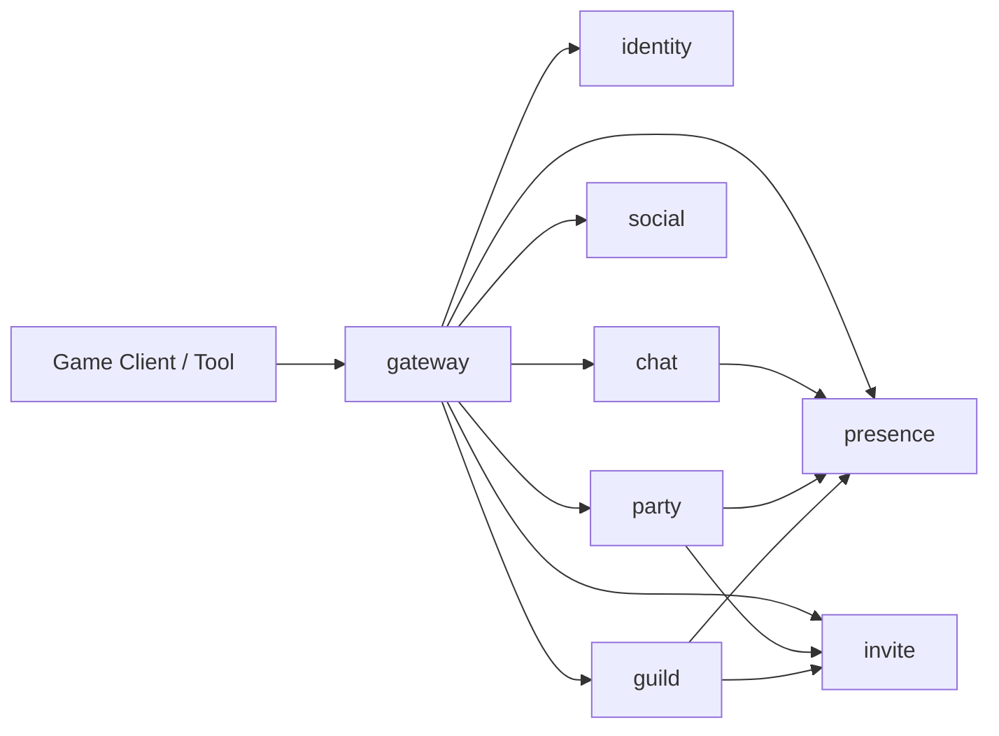

# Module Design

## Purpose

This document explains how the repository is decomposed into runtime modules, what each module owns, and how modules are expected to evolve from in-memory prototypes into durable services.

## Layer Model

The repository currently follows a four-layer split:

1. Entry surfaces
2. Domain services
3. Shared infrastructure
4. Contracts and governance

### Entry Surfaces

- `gateway` is the realtime and authenticated ingress boundary.
- `ops` is the operator-facing ingress boundary.
- direct service HTTP endpoints exist today as prototype control surfaces.

### Domain Services

- `identity`: player-scoped authentication and token lifecycle
- `presence`: authoritative online state and lightweight runtime metadata
- `social`: friend and block relationships
- `invite`: shared invitation lifecycle across domains
- `chat`: conversations, sequencing, ack, replay
- `party`: party membership, leader actions, ready state
- `guild`: guild creation, owner/member lifecycle
- `worker`: future async job execution boundary

### Shared Infrastructure

- `pkg/app`: process lifecycle and HTTP service bootstrap
- `pkg/config`: environment-driven configuration loading
- `pkg/logging`: shared logger construction
- `pkg/transport`: JSON response and error helpers
- other `pkg/*` directories stay reserved for infra concerns only

### Contracts And Governance

- `api/http`: current control-plane wire contracts
- `api/errors`: shared transport-safe error model
- `api/proto`: future internal service contracts
- `api/tcp`: future realtime transport contract
- `docs/`: plans, ADRs, architecture, operations

## Service Module Shape

Each service is expected to keep the same internal shape even as persistence changes:

```text
cmd/<service>/             process entrypoint
internal/domain/           domain entities and value objects
internal/service/          domain logic and state transitions
internal/handler/          transport adapters
internal/client/           explicit outbound service clients
internal/repo/             future persistence adapters
internal/jobs/             future async job definitions
```

## Ownership Boundaries

### Gateway

- Owns transport authentication and session-bound request attribution.
- Does not become the source of truth for social, invite, chat, party, guild, or presence state.

### Identity

- Owns account-to-player authentication outcomes.
- Exposes authenticated player context to all downstream services.

### Presence

- Owns player online state and short-lived runtime metadata.
- Receives lifecycle reports from gateway.
- Should be read by downstream services rather than duplicated.

### Invite

- Owns invitation status transitions.
- Is reused by party and guild through an explicit client boundary.

### Chat

- Owns sequencing, read cursor monotonicity, and replay semantics.
- Does not own authentication or presence authority.

### Party And Guild

- Own domain membership and leader or owner actions.
- Depend on invite for join authorization.
- Should depend on presence only for runtime behavior, not membership truth.

## Dependency Direction

The intended dependency rule is simple:

- handlers depend on services
- services may depend on clients and future repositories
- clients depend on contracts
- no domain service should depend on another service's internal package

## Runtime Topology



## Evolution Path

### Current Stage

- in-memory state machines
- HTTP control surfaces
- explicit service ownership
- contract-first documentation

### Next Stage

- presence-backed runtime checks
- stronger service-to-service contracts under `api/proto`
- repository adapters for MySQL and Redis
- gateway-driven realtime push and replay integration

### Later Stage

- TCP/WebSocket realtime protocol
- async worker flows
- audit and moderation flows
- matchmaker and external integrations
