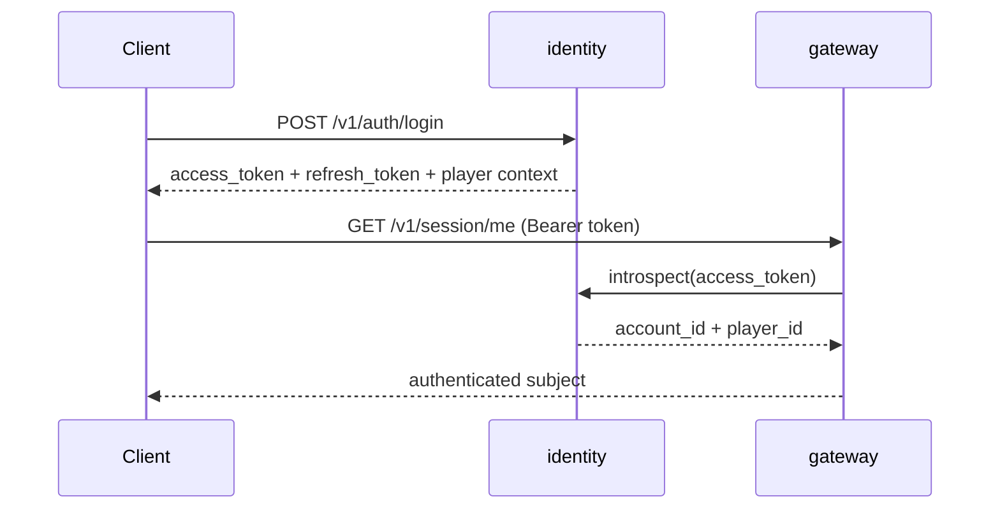
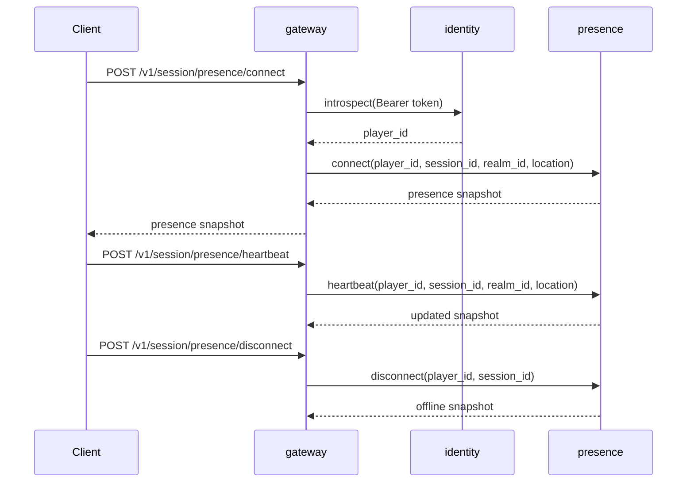
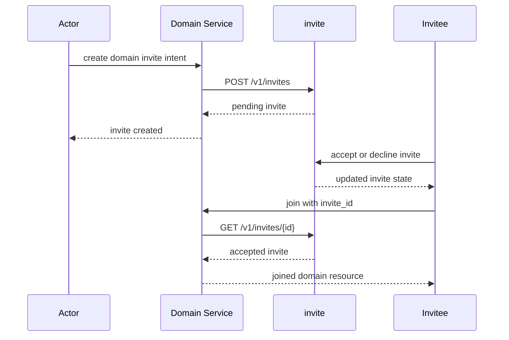
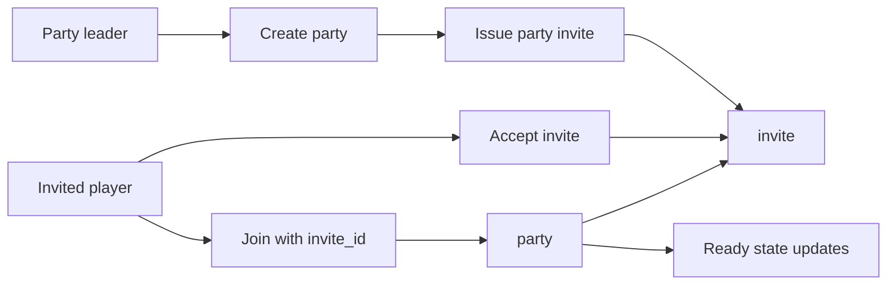
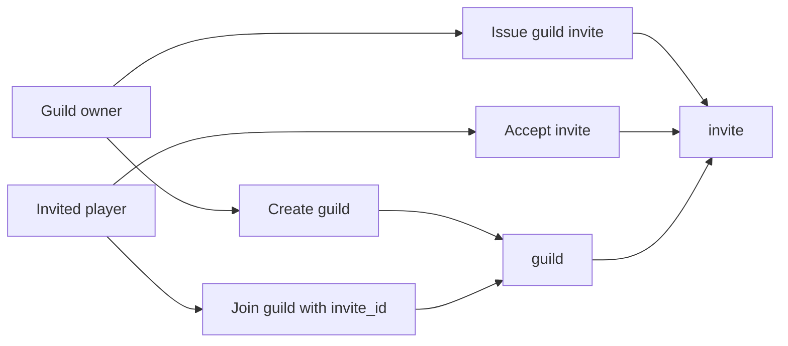
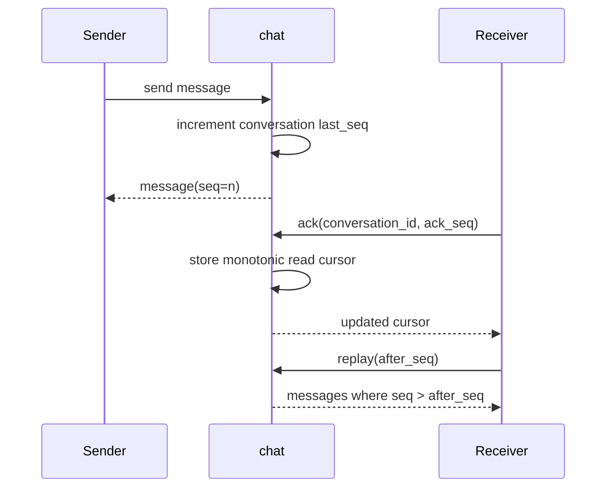

# Runtime Flows

## Purpose

This document captures the main request and state flows that matter in the current prototype stage. It focuses on sequence, ownership, and interaction points rather than transport implementation details.

## 1. Login And Session Resolution

### Notes

- identity owns token issuance and refresh
- gateway does not parse token meaning by itself
- authenticated subject becomes the basis for downstream requests

## 2. Presence Reporting

### Notes

- gateway owns authenticated attribution
- presence owns online or offline truth
- downstream runtime checks should read from presence, not from gateway memory

## 3. Shared Invite Flow

### Notes

- invite is reused by guild and party
- domain services own membership, invite owns acceptance state

## 4. Party Join Flow

### Notes

- party leader is the only inviter in the current prototype
- join requires an already-accepted invite
- ready state is owned by party, not invite

## 5. Guild Join Flow

### Notes

- current prototype uses owner-only invitation
- role model is intentionally minimal: `owner` and `member`

## 6. Chat Sequencing And Replay

### Notes

- ordering is local to each conversation
- replay is based on seq windows, not wall-clock timestamps
- future gateway push should rely on chat-owned sequencing

## Cross-Flow Implementation Details

- identity is upstream of almost every player-facing flow
- presence is upstream of future runtime-sensitive flows
- invite is upstream of shared join authorization
- chat is isolated from invite and membership mutation, but depends on stable player context
